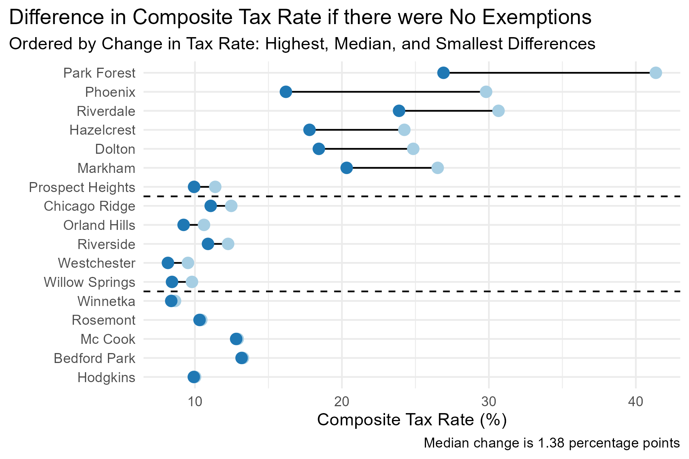
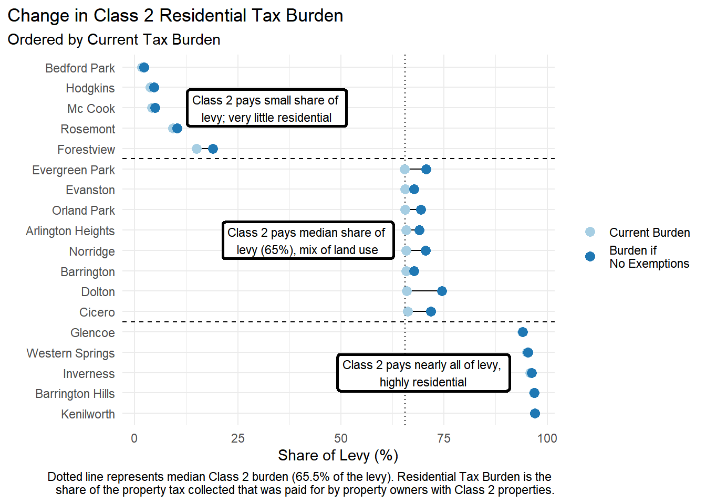
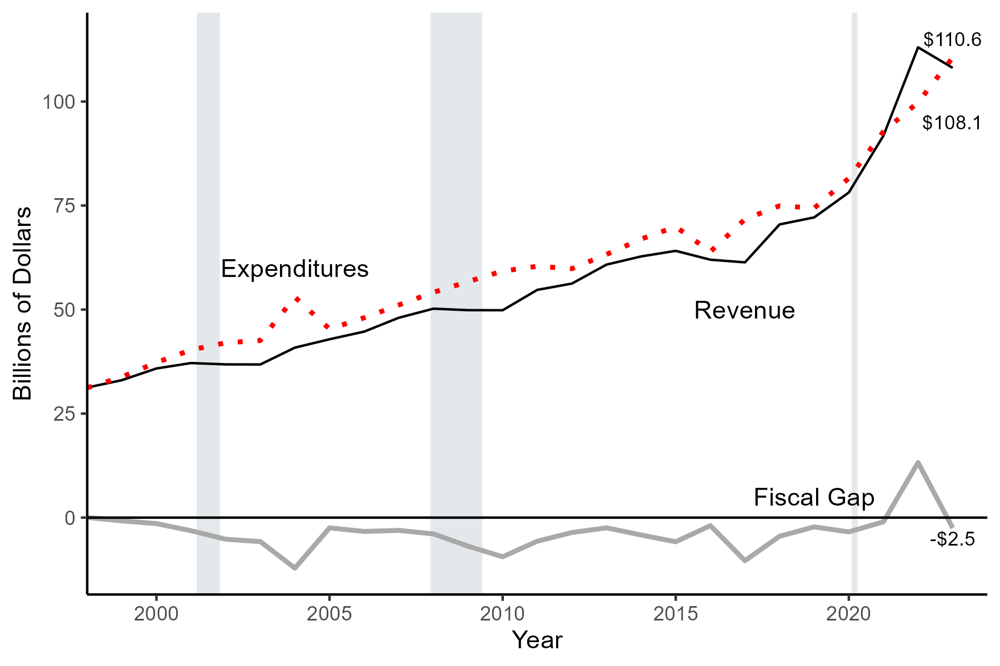
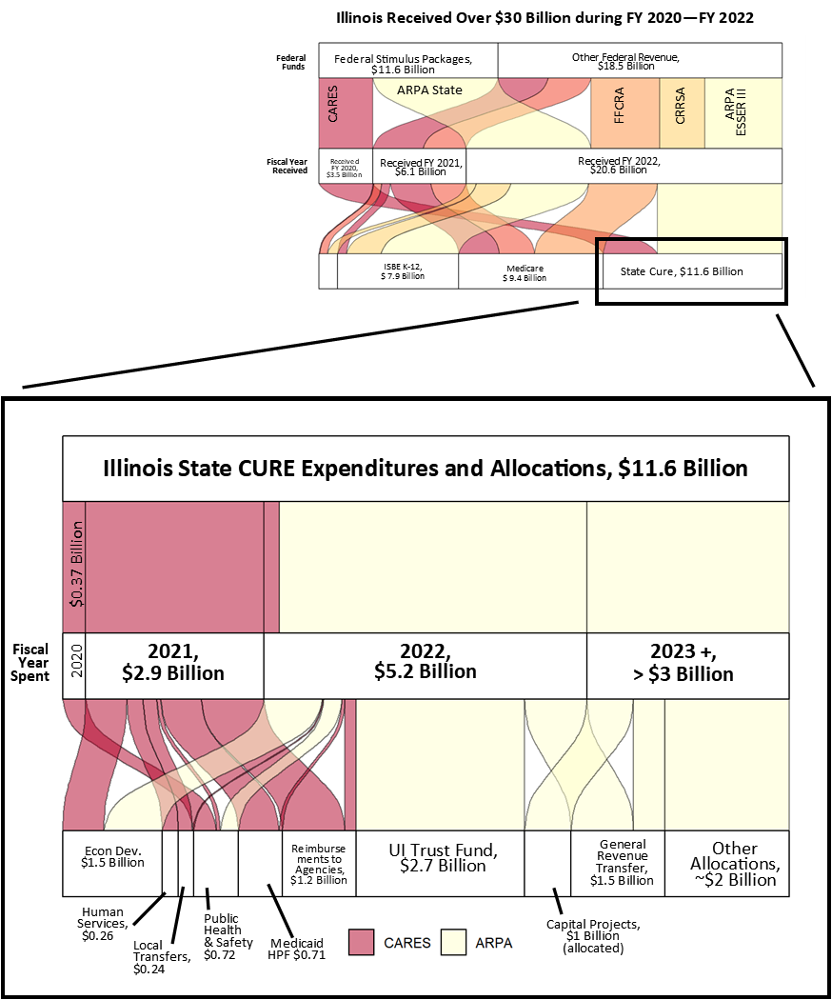

## Projects

Things I would hang on my fridge:

:::{layout-ncol=2}

:::

{width="375"}

I made a really cool loop that calculates tax rates, levies, taxable EAV, etc. for various geographies using data tables from the PTAXSIM package. It's not a pretty picture, but it is one of the most efficient code items I've ever made and I'm still impressed that I did it. [Click this link](https://github.com/uic-gfrc/CookCounty-PropertyTaxes/blob/main/scripts/ptax_pull_loop_newmethod.R) to be underwhelmed by code that does impressive things!

I also did a radio interview on the Working From Home paper: 
- Radio Interview
Schlenker, Charlie. (2024, February 16). McLean County has high potential for work-from-home permanence. [Radio broadcast]. WGLT NPR. [Listen and Read Here!](https://www.wglt.org/local-news/2024-02-16/mclean-county-has-high-potential-for-work-from-home-permanence#new_tab).    

