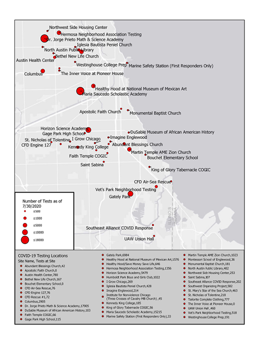

These projects show both the research and the work behind it: reconciling messy records, choosing a useful unit of analysis, and making results easier to explore. Open a project for my role, selected outputs, and links to the full materials.

::: {#portfolio}
:::

## Also on the fridge

::: {.secondary-work}
### Working from home in Illinois

Research on who can work remotely and who does, with replication materials and a public-radio interview about the findings.

[Read the report](https://doi.org/10.25417/uic.26018719) · [Explore the analysis](https://aleawm.github.io/WorkFromHome/) · [WGLT interview](https://www.wglt.org/local-news/2024-02-16/mclean-county-has-high-potential-for-work-from-home-permanence)

### Emergency management & public communication

During my 2020 internship with Chicago's Office of Emergency Management and Communications, I analyzed operational data for situation reports and created visualizations supporting the city's COVID-19 response.

{.supporting-map width=420}

### Teaching programming for public policy

I designed and taught **Programming and Data Analysis for Public Policy** at UIC in Fall 2021, developing policy-focused datasets, lessons, and exercises in R. [More about my teaching and experience](../about.qmd).
:::
